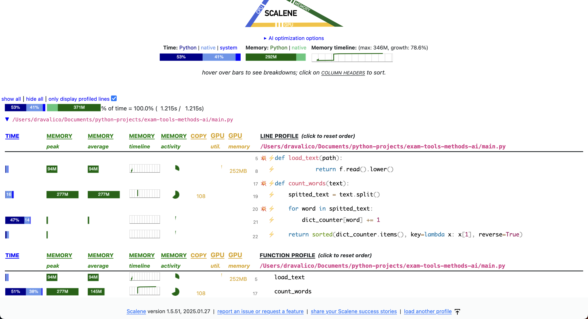
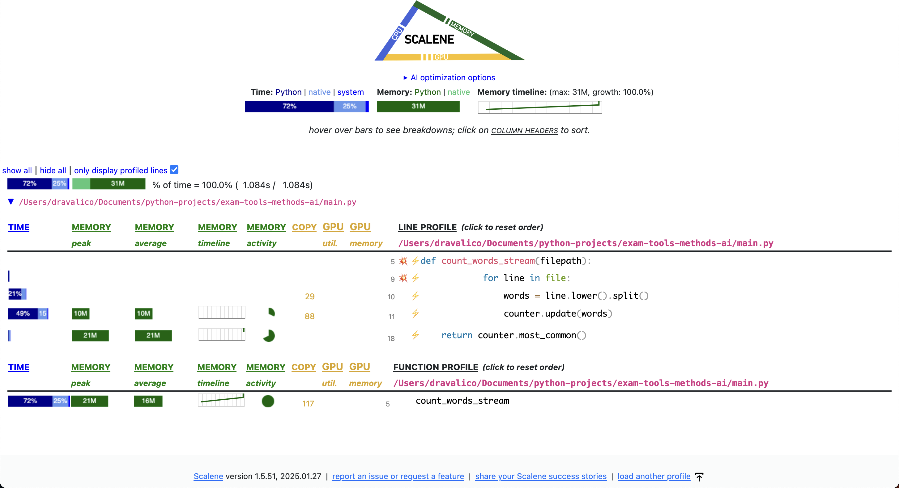

# Word Count for Large Text Files

This repository contains code developed for the exam of the *Introduction to Tools and Methods in AI* course. It implements a simple Python script to count the top-10 most frequent words in a given text file.

The project uses [`uv`](https://github.com/astral-sh/uv) to manage the Python virtual environment and dependencies, ensuring reproducibility and easy setup.

## Differences Between the Two Word Count Versions

After profiling the base code using [Scalene](https://github.com/plasma-umass/scalene), I created a separate branch named `dev` to experiment with improvements. The enhancements were verified through Scalene profiling to ensure measurable gains. For each version, two screenshots are included showing the profiling results; these screenshots are also committed as files in the repository. Since the improved version showed better performance, I merged it into the main branch, while the `dev` branch remains active for further experimentation.

### Version 1 (Simple)

- Reads the entire file into memory
- Uses a `defaultdict` to count word occurrences
- Converts the full text to lowercase and splits it once
- Drawback: **high memory usage**

As shown in the image below, loading and processing the entire file results in significantly high memory usage. Note that the profiling was performed using the 50MB `testfile.txt` file.

### Version 2 (Improved)

- Reads the file **line by line** to minimize memory consumption
- Uses `collections.Counter` for more efficient and concise counting
- Processes the file incrementally, avoiding loading it entirely at once
- Result: improved memory usage and better time consuption

Compared to the previous image, the processing time is slightly reduced. More importantly, by reading and processing the file line by line, the memory consumption decreases by approximately 89%.

